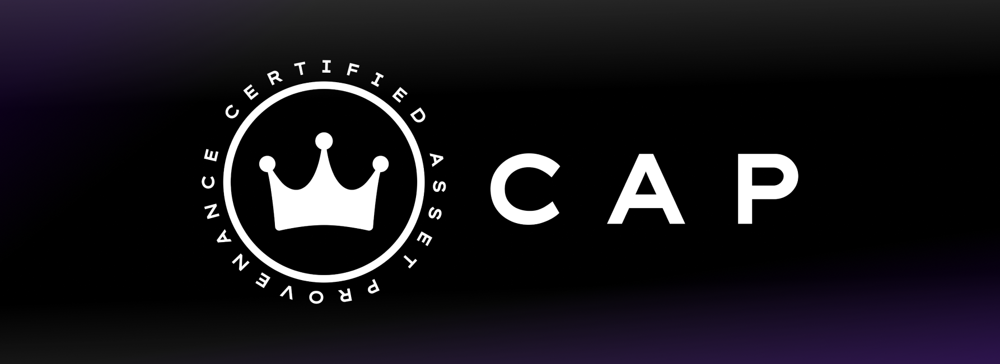

# Welcome to CAP 👋

Welcome to CAP's documentation. CAP is an open internet service providing transaction history & asset provenance for NFTs & Tokens on the Internet Computer. It solves the huge IC problem that assets don’t have native transaction history, and does so in a scalable, trustless and seamless way so any NFT/Token can integrate with one line of code.

CAP provides services to... NFTs/Tokens developers by giving them a plug-n-play history for their assets and UIs/Dapps/Sites on the Internet Computer that want to show an asset's history to users.

- Visit [our website](https://cap.ooo)
- Read [our announcement](https://medium.com/@cap_ois/db9bdfe9129f?source=friends_link&sk=924b190ea080ed4e4593fc81396b0a7a)
- Visit [CAP's main repository](https://github.com/psychedelic/cap) 
- Visit [CAP-SDK repository](https://github.com/Psychedelic/cap/tree/main/sdk)
- Visit [CAP-JS repository](https://github.com/psychedelic/cap-js) 

## 👑 CAP - Certified Asset Provenance

CAP is an open internet service on the Internet Computer that developers can utilize to give their NFT, Token (and soon many more NFTs/Tokens) traceability and provenance, with a transaction/history service.

- [Visit the overview section to learn more about how it works.](https://docs.cap.ooo/overview/what-is-cap/)

## 🧰 Getting Started with CAP

CAP as an open internet service works the following way. The main canister for CAP acts as an orchestrator that can spawn new history canisters for individual projects (NFTs, Token Canisters, DEX's, etc.).

- CAP's Mainnet canister: `lj532-6iaaa-aaaah-qcc7a-cai`

!!! Important

    CAP is currently in early stages 🚧 this documentation will continue to grow with the project!

### 🛢️ Integrating NFT/Token Canister to CAP to give it a History.

Looking to integrate CAP to an NFT or Token to give it a transaction/activity history in CAP? 

1. [Get started with the CAP SDK.](https://docs.cap.ooo/integrate-cap/getting-started/)

### 📈 Integrating CAP to an UI/App to Show an Assets History/Activity.

Want to query data from CAP from your UI/App/Dapp website? With CAP you can provide your users with great UI/UX's by:

Displaying historic data of an asset (e.g. NFT's past sales and transfers); showing transaction history of custom tokens in your platform; or by creating UI's with general asset statistics (consuming all data in CAP!).

- [Get started with the CAP-js library.](https://docs.cap.ooo/surface-data/getting-started/)

## 👑 Moonwalkers, Portal, and other Early Supporters

We are kickstarting the CAP ecosystem with a group of early Tokens & NFTs that will be integrating CAP to give their NFTs/Token an activity history!

- [Moonwalkers (NFTs)](https://twitter.com/ic_gallery)
- [Portal (NFTs)](https://portal.one/)
- [DFinance (Tokens)](https://dfinance.ai/)
- [Cycles Token (Tokens)](https://dank.ooo/xtc/)
- [ICSnakes (NFTs)](https://xn--4n8h7h.ws/)
- [ICPSquad (NFTs)](https://twitter.com/ICPSquadNFT)

## 🔌 Plug's Integration and Role

As for **Plug's integration**, it isn't only to show users the transaction history of tokens/NFTs in their wallet that support Plug. 

Plug will also integrate CAP to play an important role in seeding the transaction history for any project that can be held/surfaced in Plug, whether it has already integrated CAP or not.

This way, Plug can create an early activity history for users on their wallet, who will see an activity for any NFT/Token they trade with through Plug. Then, when the NFT/Token fully integrates CAP it will already have some records to populate their history canister.

Still, **we strongly recommend** that projects fully integrate CAP directly into their canisters so all activity across the entire IC will be captured, and not just activity going through Plug.