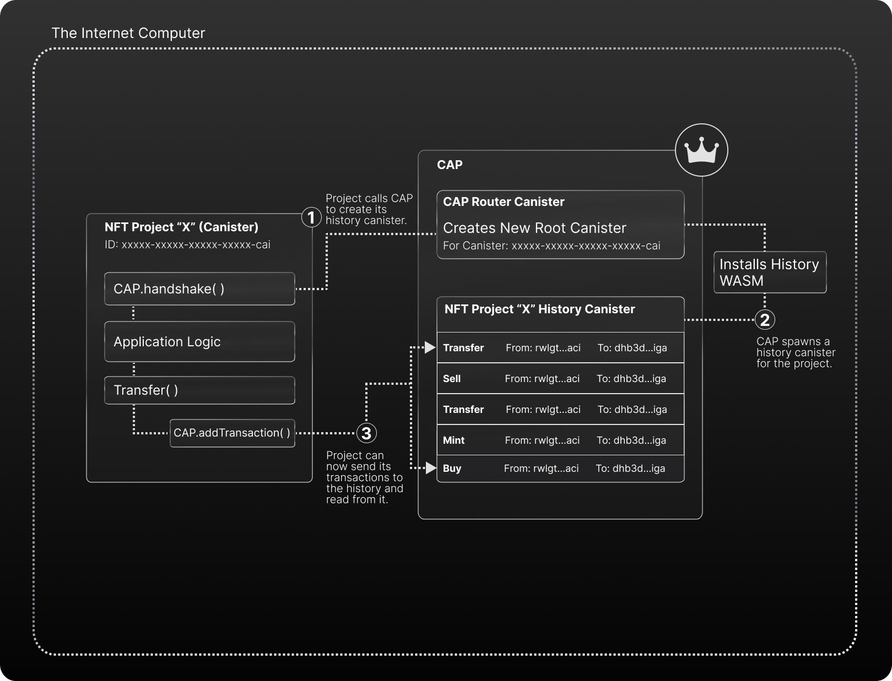

# 👑 Overview - What is CAP?

## 👑 Overview - What is CAP?

CAP is a standard agnostic open internet service that provides transaction history & asset provenance to assets (NFTs and Tokens) on the IC.

It solves the issue that there is **no standard for transaction history/provenance** when it comes to assets (or activity in general) on the Internet Computer in a scalable and trustless way that any project can integrate and that is flexible enough to evolve into **general activity provenance in the future** (recording any type of event for any type of project).

At the moment, CAP has **two clear use cases**:

## For NFTs/Token Projects - A History & Provenance Provider 📜

When it comes to NFTs/Tokens on the Internet Computer, CAP is a service that they can integrate to give their assets a **scalable, trustless, and standardized transaction history**.

Instead of building, maintaining, and scaling a custom transaction history canister infrastructure; a new or existing project can connect their asset's canister to CAP **to access a transaction history seamlessly and start gathering records for their asset's events (mint, transfer, sell, etc..) as the methods themselves are triggered in the NFT/Token canister.**

The records will be gathered and saved in a project-specific history in CAP; and the Token/NFT can still access its own history by calling the NFT/Token's own methods directly (e.g. getTransaction), not needing to call CAP itself. 

## For UIs/Apps - A Way to Surface Asset History Data 🔍

Now, on the other hand, for UIs, apps, and front-ends that deal with assets in their experiences; they can integrate to CAP to **surface the transaction history of any asset using CAP**.

CAP's main canister acts as a router to all the histories of all projects integrating CAP; therefore a UI, **instead of having to integrate and call to each asset's history individually (as it happens today)**, can instead use CAP's main canister as a router to access **all the assets transaction history easily**.

It provides a cleaner and easier way of giving users visual access to their asset's transaction history and opens the door to amazingly transparent & trust-oriented experiences, like:

- Showing an NFT's past sales, owners, and prices on a marketplace.
- Showing a user historic transactions for more tokens than just ICP.
- Building UIs & apps that analyze an asset's movements and activity.

## CAP's Architecture - How Does it Work? 🧠

CAP as an open internet service works the following way. The main canister for CAP acts as an orchestrator that can spawn new history canisters for individual projects (NFTs, Token Canisters).

When integrating CAP to their Token/NFT canister (using the CAP SDK), projects will call CAP to spawn a new history canister in CAP that will **only accept transaction submissions from the canister/project** that initialized it.

In a nutshell, CAP deploys a transaction history infrastructure that **only your project can use**. And once you do so, you can connect your project’s canister by connecting the transaction method to your project’s history canister, automatically passing the transaction records when a transaction/event is executed.

Now that your project’s CAP history canister is bustling with transaction data, you can surface that transaction data **directly from your NFT / Token’s canister, using the same methods as before.** 

While on the other hand, UIs/Front-ends can integrate CAP using the CAP-js library to consume not just one project's data, but any project using CAP.

> As of V1, CAP's spawned history canisters can hold up to 400,000 transactions on the conservative side; and in the following update we will implement scaling, following the same approach implemented in [Dank's Cycles Token (XTC)](https://medium.com/dank-ois/cycles-token-xtc-update-history-scaling-239778df2ad2).

## Early Data Redundancy Off-chain 🗄️
We know that it's still early days for the Internet Computer, and for CAP, so on release of CAP, Psychedelic will backup all CAP data off-chain for extra data security/redundancy, and at no cost to CAP or it's users.

In the short-term future we will look into periodically backing up data to Filecoin as well. This is to ensure data can never be lost, even in the unlikely event of an IC upgrade that corrupts data.