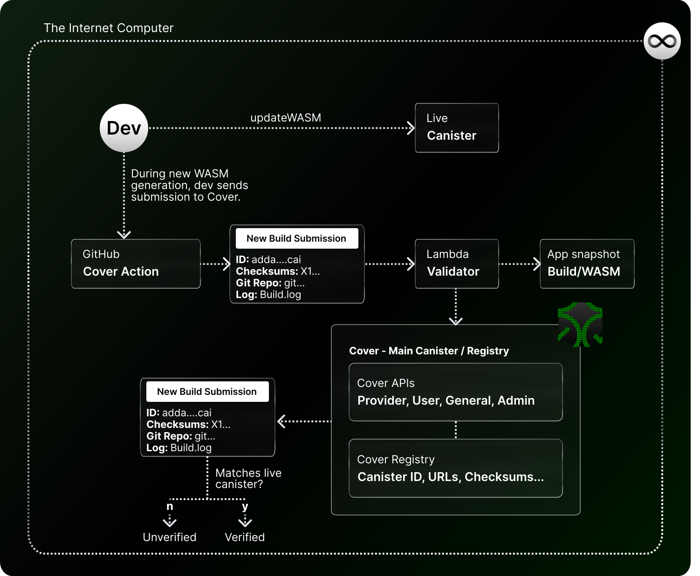

# ✅ Overview - What is Cover?

## ✅ Overview - What is Cover?

Cover (short for Code Verification) is an open internet service that helps **verify the source code of canisters on the Internet Computer**. 

It does so by having developers submit public versions/builds during their development workflow, keeping a registry of them, and using that information to compare the WASM Checksum of the provided version with the **live canister on mainnet**. If the WASM checksum matches, the code/build provided generates the same WASM file and therefore is verified.

Cover helps mitigate **malicious actors, modified code, or unsafe practices** by promoting a transparency model **where developers openly submit their public code, and provide proof that it is indeed the live implementation.**

## How does Cover work?

The open internet service is fairly straightforward in terms of architecture. There are two main components in Cover.

First, the **Cover registry**, which receives version/build submissions from developers that are associated **to a Canister ID** (the canister to which they should be compared with).

Secondly, the **Cover GitHub Action**, or the "entry point" through which developers make their submissions to the Cover registry. The initial version of Cover only includes this GitHub Action as its entry point for submissions, but that might evolve in the future. The GitHub action will take a snapshot of the the build (CanisterID, Checksums, etc.) that will be kept in Cover's registry for verification.

There are **secondary components** that complete the workflow in the aforementioned architecture:

- **Lambda Service:** Connects the GitHub Action to the Cover registry.
- **The ProviderAPI:** Cover API used to enter submissions.
- **The UserAPI:** Cover API used to create requests.
- **The GeneralAPI**: Used to query a canister's verification status.
- **The AdminAPI**: Used for potentially in the future adding new providers (sources, e.g. GitHub Action).