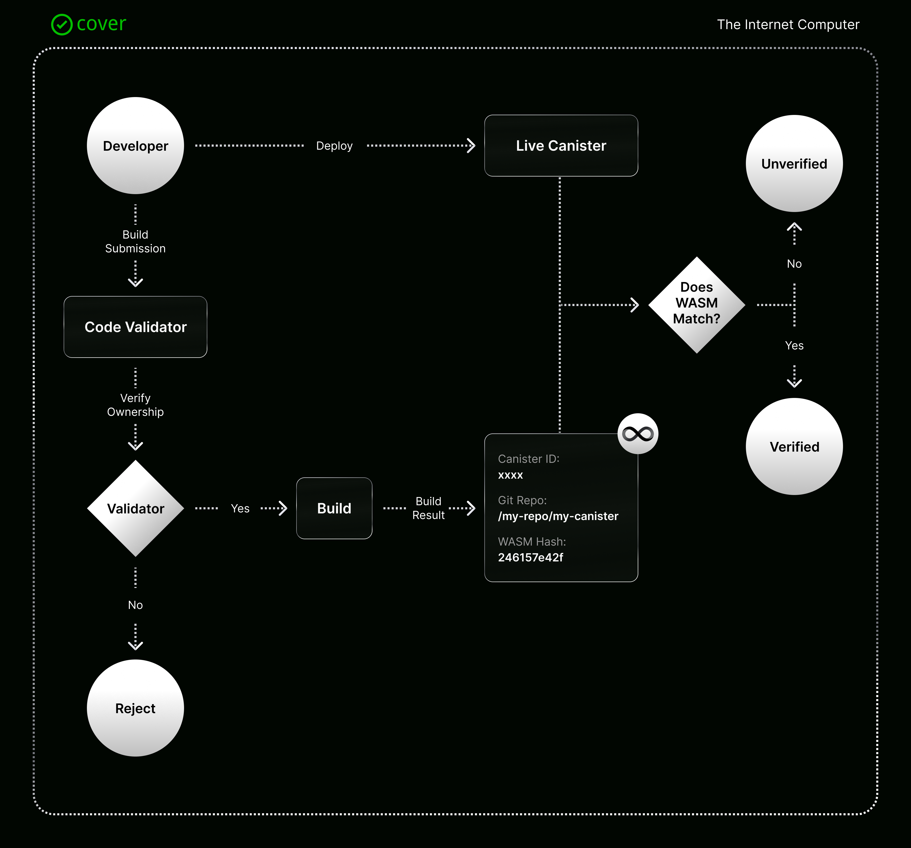

# ✅ Overview - What is Cover?

## ✅ Overview - What is Cover?

Cover (short for Code Verification) is an open internet service that helps **verify the source code of canisters on the Internet Computer**. 

Developers can provide the config they used to build their canister and Cover builder will rebuild their canister exactly how they built it to reproduce the same WASM. After building, Cover will keep a verification and use the rebuild WASM hash to compare with the live canister on the mainnet. If the WASM hash matches, the code/build provided generates the same WASM file and therefore is verified.

Cover helps mitigate **malicious actors, modified code, or unsafe practices** by promoting a transparency model **where developers openly submit their public code, and provide proof that it is indeed the live implementation.**

## How does Cover work?

Cover is made out of 3 main components the builder, the canister, and the validator. You put it all together and you are able to validate if the code in a repository build is the same as the one deployed in a canister.

The canister's role is to be the main entrance for the users, is where the information about the different verifications are stored, and exposes the API for the users. On top of this is where the UI will be built.

The builder's role is to generate the build from the code submitted and makes the verification status of the code.

The validator's role is to stand in between the canister and the builder, so it validates the configurations and the request and is the one that triggers the build request.
